# 🌩️ NimbusWS — Resilient WebSocket Gateway with Kafka & Redis


> 🚧 **Early Development:** Expect frequent changes and evolving features.

**NimbusWS** is a horizontally scalable, stateless WebSocket gateway powered by [Fastify](https://www.fastify.io/), Kafka, and Redis. It provides resilient message delivery and automatic reconnection across node restarts—ideal for high-availability systems.

---

## 🚀 Key Features

- 📡 WebSocket server built on Fastify and `@fastify/websocket`
- 🧠 Client-aware Kafka event consumption
- 🔁 Seamless reconnections with offset tracking in Redis
- 🧱 Stateless pods for zero-downtime failover
- 🐳 Docker Compose support for local development
- 🔗 Redis-powered client session and offset registry

---

## 📐 Architecture

### Approach 2


### Approach 3

```mermaid
graph TD
    subgraph Clients
        A1[Mobile Client]
        A2[Web Client]
        A21[IoT Devices]
    end

    subgraph WebSocket Server
        subgraph Client Socket Mapping
            A4[client_id1 ⟶ Socket1]
            A41[client_id2 ⟶ Socket2]
        end
        A3["WebSocket Manager (Fastify)"]
        AR1["Redis Subscriber (per pod)"]
        A5[Kafka Producer]
    end

    subgraph Kafka Topics
        B1[Topic: Events]
        B2[Topic: Results]
    end

    subgraph Kafka Event Processor
        C1[Consumer reads Events ⟶ writes Results]
    end

    subgraph Redis Cluster
        R1[Redis Pub/Sub: Client Channels]
    end

    subgraph Persistence Layer
        B5[Kafka Consumer Group: Storage Writer]
        B6[DynamoDB: Processing Results]
    end

    subgraph Result Dispatcher
        X1[Kafka Consumer reads Results ⟶ Redis Publisher]
    end

    %% Connections
    A1 <--> A3
    A2 <--> A3
    A21 <--> A3
    A3 --> A5
    A5 --> B1
    B1 --> C1
    C1 --> B2
    B2 --> B5
    B5 --> B6
    B2 --> X1
    X1 --> R1
    R1 --> AR1
    AR1 --> A3

```




---

## 🧰 Tech Stack

- **Node.js + Fastify**
- **Kafka (Apache Kafka or Redpanda)**
- **Redis (ioredis)**
- **Docker + Docker Compose**

---

## 🛠 Getting Started

### 1. Clone the Repository

```bash
git clone https://github.com/learningfun-dev/nimbusws.git
cd nimbusws
```

### 2. Start All Services with Docker Compose

```bash
docker compose --profile all up --build -d
```

This will start the following containers:

| Container             | Description                                  | Access Point                                  |
|-----------------------|----------------------------------------------|------------------------------------------------|
| `redis`               | Redis for pub/sub and offset tracking        | `localhost:6379`                               |
| `redis-insight`       | Redis Insight UI                             | [http://localhost:5540](http://localhost:5540) |
| `broker`              | Kafka broker (KRaft mode)                    | `localhost:9092`                               |
| `kafka-ui`            | Kafka UI for topic/consumer inspection       | [http://localhost:8080](http://localhost:8080) |
| `dynamodb-local`      | Local DynamoDB instance                      | [http://localhost:8000](http://localhost:8000) |
| `dynamodb-admin`      | Web UI for DynamoDB                          | [http://localhost:8001](http://localhost:8001) |
| `nimbus-ws-server`    | WebSocket + Kafka gateway (NimbusWS app)          | [http://localhost:3000](http://localhost:3000) |
| `nimbus-ws-consumers` | kafka consumers and Redis publishers (NimbusWS app)    | [http://localhost:3000](http://localhost:3000) |

**Docker Profiles**

- `all`: Launches all services.
- `dev`: Core services (without `nimbus-ws-server` and `numbus_ws_consumers`).
- `nimbus-ws-server`: Only the `nimbus-ws-server` WebSocket service.
- `numbus_ws_consumer`: Only the `numbus_ws_consumers`.

---

### 3. Local Development

**Start dependencies (without `nimbus-ws-server` and `numbus_ws_consumers`)**:

```bash
docker compose --profile dev up -d
```

**Install dependencies**:

```bash
npm install
```

**Clean dist folder**
```bash
npm run clean
```

**Clean vol-data folder**
```bash
npm run clean-vol-data
```

**Start Nimbus server**:

```bash
npm run dev
```

**Start kafka Producers and Consumers**:
To start the external Kafka services, run:

```bash
npm run kafka-producer-and-consumers
```

These processes include Kafka producers and consumers that run independently from the Nimbus server. Here's what they do:

1. Common Kafka Producer: Sends data to the Kafka topic provided as a parameter to the sendToKafka function.
1. Consumer for Approach 2: Listens to the events topic and processes incoming messages.
1. Consumer for Approach 3: Another processor for the same events topic, specific to the third approach logic.
1. Results Consumer (Approach 3): Listens to the results topic and publishes processed messages to the appropriate Redis channel.


---

## 🧪 WebSocket Testing

You can use `wscat`, Postman, or any WebSocket client.

### Connect Clients

#### Approach 2

```bash
npx wscat -c ws://localhost:3000/approach2/events?clientId=my-client-id
```

#### Approach 3

```bash
npx wscat -c ws://localhost:3000/approach3/events?clientId=my-client-id
```

**Sample Event Payload**:

```json
{
  "type": "event",
  "data": "this is a sample event"
}
```
---

## 🔗 Related Projects

- [Fastify](https://github.com/fastify/fastify)
- [KafkaJS](https://kafka.js.org/)
- [ioredis](https://github.com/luin/ioredis)
